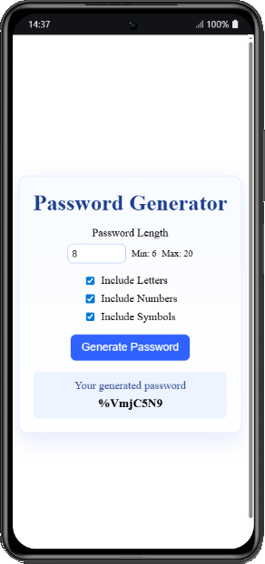
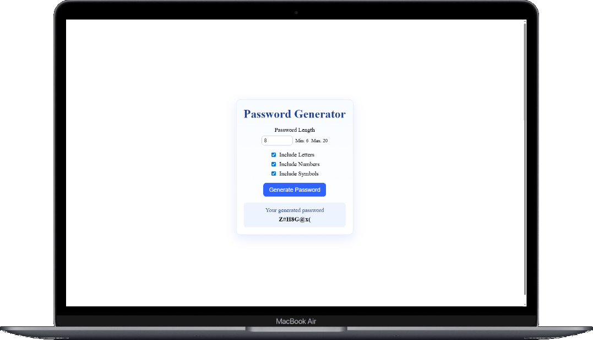

# PasswordGenerator


Password generator built with **Angular**.  
Originally generated with **Angular CLI 17.2.3**, later updated to **Angular 21**.

---

## 💻 Live Demo

👉 **[Password Generator (Click Here)](https://password-generator-dfleper.netlify.app/)**

---

## 🧩 Features

- Generate secure random passwords.
- Configure **length** of the password.
- Enable/disable:
  - Uppercase letters
  - Lowercase letters
  - Numbers
  - Symbols
- Copy password to clipboard in one click.
- Simple, clean and responsive UI.

---

## 🚀 Getting started

**Clone Repository**

```bash
git clone https://github.com/dfleper/PasswordGenerator.git
```
```bash
npm install
```

---

## ▶️ Development server

Run the development server with:

```bash
ng serve
```

Then navigate to:

```bash
http://localhost:4200/
```
---

## 📸 ScreenShots

<p float="left">
  
  
</p>

## 🛠 Requirements / Requisitos

- 🛠 **[Visual Studio Code](https://code.visualstudio.com/)**  
- 🛠 **[Node.js](https://nodejs.org/)** 
- 🛠 **[Angular](https://angular.dev/)**